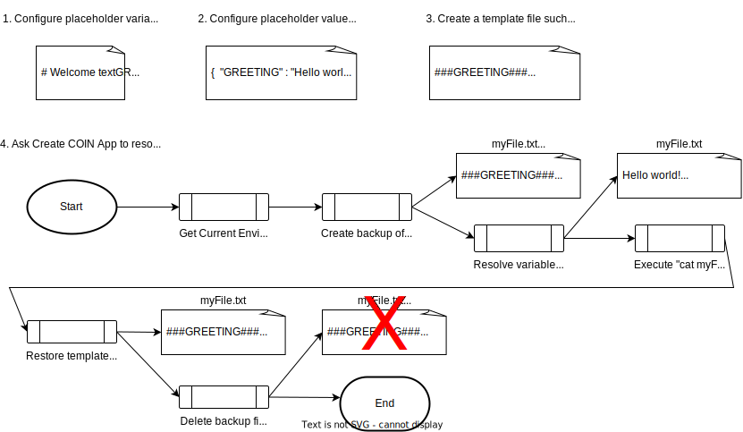
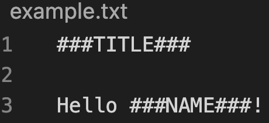

# COIN Shell Documentation

This page documents COIN Shell in detail. For a project overview, see the [README](README.md). For details on the latest changes to COIN Shell, see the [CHANGELOG](CHANGELOG.md).

## Support for Deploying App to Multiple Environments

An environment is a deployment with unique configurations that can run 
independently in the same (or different) AWS account/region as other deployments.

The wizard-generated application code will contain placeholders for values
that need to be set per environment before the application can be
deployed. The placeholders are easy to find, since they are surrounded
by 3 pound signs. 

Here are some examples of placeholders:

#&#8203;#&#8203;#&#8203;ENVIRONMENT_NAME#&#8203;#&#8203;#&#8203;

echo This app is called #&#8203;#&#8203;#&#8203;APP_NAME#&#8203;#&#8203;#&#8203;

One approach to creating an environment-specific deployment for the 
app is to create a Git branch per environment and then
search and replace all of the placeholders and commit those changes
to the environment branch.

This approach works fine but it has the following drawbacks:
* It can be tedious keeping the main branch up to date and the
environment branch and then creating feature branches off of the
environment branch.
* Code might accidentally get checked in that has environment-specific
values hardcoded into the files.
* After pulling the latest code from main, there may be a placeholder
that you may not realize needs to be switched out, then you may try
to deploy to a personal environment with unresolved placeholders.
* There is no out of the box error checking to make sure all placeholders
have been set to a real value.

COIN Shell addresses these issues by automatically resolving placeholders and environment variables based upon your configuration values. It does this for you when deploying your code. It then restores the code files back to their original state so that there are no changes that a "git status" would report.

Note - placeholders are only used in file types that do not support reading environment variables. For code files that can read env vars, simply reference environment configurations via environment variables. When you run any Make command, COIN Shell will automatically expose all of your configurations as environment variables so that they can be used by your code.

## Environment Utilities

The new app creation wizard from this project can generate environment
utilities that help in a variety of ways, including not requiring
developers to create a Git branch per environment. 

The environment utilities will be placed under an application directory
named `environment`. The `environment` directory will contain a Makefile
that has intuitively named tasks for using the environment utilities.

None of the application code depends on the existence of the environment
utilities, so the `environment` directory can be deleted from the application
code if desired. In contrast, if a CICD pipeline generated for the app by the
new app creation wizard, it will depend on the environment utilities unless 
it is modified to remove this dependency.

## Environment Utilities Files

The `environment/app-env-var-names.txt` file contains the names of the application
environment variables. This file should be committed to version control. If you 
add a value here, the environment utilities will consider that variable as a 
required configuration before you can deploy your application.

The Create New Application Environment Wizard uses the `environment/app-env-var-names.txt`
so that it can know what input is required by the user when creating a new
application environment.

Note: If you want to set a configuration value to an empty string, you should 
set it to the literal word, "blank", and the environment utilities will resolve
the placeholder value with an empty string.

Here is an example `app-env-var-names.txt` file that indicates "APP_NAME" and 
"ENV_NAME" should be treated as required settings:
```
# The application name that is used to name resources
APP_NAME

# The environment name that is used to name resources and to determine
# the value of environment-specific configurations.
ENV_NAME
```

***
The `environment/.environment-<env-name>.json` file is generated by the environment utilities
when you create or import an environment. It holds all of the configuration
values for a specific application environment. This file should never be 
committed to version control if it contains sensitive values. 

Imagine that our application is called "awesome-sauce" and that we created an application environment called "dev".
Here is an example of `environment/.environment-dev.json`:
```
{
  "APP_NAME": "awesome-sauce",
  "ENV_NAME": "dev"
}
```

The environment utilities also support the following built-in placeholders,
which should NOT be configured in the 
`environment/.environment-<env-name>.json` file:
* CUR_DIR_NAME - this will be resolved to the name of the directory that 
contains the file with placeholders.
* gitProjectName, gitProjectGroup, gitRepoDomain - these will be resolved based
upon the current git repository settings

***
The `environment/environment-constants.json` file is generated when you run the
Create New Application Environment Wizard. It holds all of the configuration
values that should remain constant across all application environments. This file is
committed to version control.

***
The `environment/.environment-<env-name>-sensitive.json` file can be manually created
if you want to commit your environment JSON file to version control but you need to remove
sensitive values from it first. In this case, you can set all of the sensitive values in
your committed file to the literal value, "sensitive". This makes it safe to commit the JSON
file to version control. Next, you can locally create a new file to hold sensitive values.
The file with the sensitive values must not be committed into version control.

Example `.environment-shared.json` file with some sensitive values:
```json
{
    "APP_NAME": "example",
    "MY_SENSITIVE_VALUE": "sensitive"
}
```

Example `.environment-shared-sensitive.json` local file that allows you to set the sensitive values:
```json
{
    "MY_SENSITIVE_VALUE": "1234"
}
```

***
The `environment/.cli-profiles.json` file can be created by users to map AWS CLI profiles
to their application environments. It should not be committed to version control.

If this file is configured, then the scripts under the `environment` directory will
set the `AWS_PROFILE` environment variable to the value that matches the current
application environment. This will make it so that any scripts that utilize the
AWS CLI will do so using the correct profile. 

If all of your application environments utilize the same profile, you can configure
a "default" environment profile that will be used by all environments instead of
configuring a profile explicitly for every application environment.

Here is an example of `environment/.cli-profiles.json`.
In the below example, all environments will use the "defaultprofile" except for the
"qa" environment, which will use the "qaprofile". 
```
{
    "default": "defaultprofile",
    "qa": "qaprofile"
}
```

For reference, you can configure an AWS CLI profile by adding a configuration to `~/.aws/config` like the below example:
```
[profile myprofilename]
output = json
region = us-east-1
credential_process = my-tool credentials --awscli <project-ID> --role Admin --region us-east-1
```

***
The `environment/.current-environment` file is generated by the environment utilities
when you create an environment. It should not be committed to version control.
You can set the value directly by editing this file or you can run `make switch-current-environment` to do it for you.

Here is an example of `environment/.current-environment`
```
dev
```

***
The `environment/utility-functions.sh` script contains all of the Bash shell script
functions that implement the environment utilities. 

You can get a list of functions defined in this file by running `make util`
from the environment folder.

You can directly execute a specific function defined in this file by running 
`make util f=<functionName>` from the "environment" folder. The 
`environment/Makefile` will automatically export all values defined in your
`.environment-<env-name>.json` for the current environment into the shell so
that they are available as environment variables for the function.

***

## Visualizing How Template Variables Are Resolved



***

## Environment Utilities - Accessing Your Environment Configurations JSON

The `environment/utility-functions.sh` script contains many helpful features.
Most of the features rely upon the values configured in the  
`environment/.environment-<env-name>.json` file being set as environment variables
in the current shell. To simplify this, the `environment/Makefile` automatically
sets the values for the current environment into the shell before it calls the
`environment/utility-functions.sh` script. If you want to call functions in
`environment/utility-functions.sh` directly from your shell, you need to first
set the environment variables like so:
```
source $projectDir/environment/utility-functions.sh export_local_app_env_vars
```

## How to Use Environment Utility Features In The Generated Application

When you generate a prototype project with the Create COIN App Wizard,
it will create a `Makefile` for you that has easy-to-use targets to execute
all of the environment utility features. This file has all of the valuable
functionality of the environment utilities preconfigured for you. For example, 
you can execute the command `make ce` that will kickstart a wizard for creating 
a new application environment for you to use. This `Makefile`, which is located 
in the `environment` directory of the generated project, is designed to drastically reduce any learning curve associated with using the environment utilities. To 
understand the power and convenience of the utilities, read the `environment/Makefile`, which includes comments on what each target does.

Below, several examples are listed for documentation purposes - but remember -
use the `environment/Makefile` targets instead of running the examples below
directly.

### Examples

***
**See the names and values of all of your environment settings. This is
useful for quickly confirming whether your environment is configured
correctly:**

Here is how do this **with** Make
```
cd $projectDir/environment

make print-current-environment
```

Here is how to do this **without** Make
```
cd $projectDir/environment

source ./utility-functions.sh export_local_app_env_vars
./utility-functions.sh print_current_environment
```

***
**Execute environment-specific deployments without changing any files or
creating an environment-specific Git branch.**

This feature automates the following steps:
1. Create a copy of a file with placeholders
2. Resolve all of the placeholders in the file
3. Execute a command against the file
* Examples
    * `terraform apply`
    * `cloudformation deploy`
4. Delete the resolved file
5. Restore the original file copy

Below are some common examples.

Exectute a Terraform module called "myModule" that has placeholders 
in its `terraform.tfvars` and `backend.tf` files:
```
cd $projectDirectory/environment

./utility-functions.sh exec_tf_for_env myModule
```

Running the above command will result in "terraform apply" being run on your module.
If you want to run another Terraform command, such as "destroy" or "plan", 
you can do so by setting the `TF_MODE` environment variable. Here is an example:
```
cd $projectDirectory/environment

TF_MODE=destroy ./utility-functions.sh exec_tf_for_env myModule
```

Exectute a CDK v2 (TypeScript) module called "myModule" that has placeholders 
in the .ts files in the `bin` and `lib` directories:
```
cd $projectDirectory/environment

./utility-functions.sh exec_cdk_for_env myModule
```

Running the above command will result in "cdk deploy" being run on your module.
If you want to run another cdk command, such as "synth" or "destroy" or "diff", 
you can do so by setting the `CDK_MODE` environment variable. Here is an example:
```
cd $projectDirectory/environment

CDK_MODE=destroy ./utility-functions.sh exec_cdk_for_env myModule
```

If you need to override the region that CDK deploys to, follow this example:
```
COIN_OVERRIDE_AWS_DEFAULT_REGION=us-west-2 ./utility-functions.sh exec_cdk_for_env myModule
```

Exectute a CloudFormation module called "myModule" that has placeholders 
in the CloudFormation template file:
```
cd $projectDirectory/environment

./utility-functions.sh exec_cf_for_env myModule
```

Run arbitrary commands that can make use of application environment 
configurations as environment variables, without attempting to resolve
any file templates.

```
cd $projectDirectory/environment

.utility-functions.sh exec_no_template_command_for_env 'echo env is $$ENV_NAME'
```

Run arbitrary commands on templates after placeholders have been
resolved, then restore the templates back to their original state
before the placeholder resolution took place.

The easiest way to run arbitrary commands is to create a script that will
run all of your commands. For example, we can create a "my-script.sh" file
under the build-script directory and then call it like so:

```
cd $projectDirectory/environment

./utility-functions.sh exec_command_for_env "../build-script" "bash my-script.sh"
```

Here is a more manual approach to doing the same thing.
In the below example, we replace placeholder values in all template files located
in the "my-template-dir" directory, but we take a backup copy of the 
files before we change them. Next, we can run any arbitrary commands we want
on the resolved templates. Finally, we put the files back to where they were
when we started. The changed files are deleted and the backup files are
reinstated, leaving no local file changes behind.
```
cd $projectDirectory/environment

./utility-functions.sh resolve_template_files "backup" "../my-template-dir"

# run arbitrary shell commands now

./utility-functions.sh restore_template_files "../my-template-dir"
```

If you want to take a backup up of the original template files so that they
can be restored to their original contents later and you want to limit
the template resolution to a subdirectory in your project, you can pass 
in these optional arguments to the `resolve_template_files` function:

```
resolve_template_files "backup" "../iac/roots/example"
```

To restore the template files from the backups, use this command:
```
./utility-functions.sh restore_template_files "../iac/roots/example"
```

***
**Look up values from the AWS SSM Parameter Store or Secrets Manager and Use Them to Resolve Template Placeholders**

This feature is called dynamic placeholder resolution.

You first need to add an entry into `environment/dynamic-lookups.sh` that will
map your placeholder name to an SSM Parameter Store key or Secrets Manager secret name.

Below is an example that maps the "SSM_MY_CONFIG" placeholder to an SSM
parameter that holds a password value:
```
LOOKUPS[SSM_MY_CONFIG]=/$APP_NAME/$ENV_NAME/password
```

Make sure that `SSM_MY_CONFIG` is also listed in `environment/app-env-var-names.txt`.
All entries in `environment/app-env-var-names.txt` that should be resolved by SSM
Parameter Store lookups should have a name that begins with "SSM_".

Note - all SSM lookups will pull from the project's AWS_DEFAULT_REGION by default, but this behavior can be
overridden by placing the region in the variable name itself. Example of looking up from us-west-2:
```
LOOKUPS[SSM_US_WEST_2_MY_CONFIG]=/$APP_NAME/$ENV_NAME/password
```

Below is an example that maps the "SECRET_MY_CONFIG" placeholder to a secret
that holds a secret value:
```
LOOKUPS[SECRET_MY_CONFIG]=my/secret1
```

Make sure that `SECRET_MY_CONFIG` is also listed in `environment/app-env-var-names.txt`.
All entries in `environment/app-env-var-names.txt` that should be resolved by Secrets
Manager lookups should have a name that begins with "SECRET_".

If you have a secret that contains a JSON value and you want to retrieve a specific
property of that JSON and set that property value as the value of your lookup variable,
you can do so using a configuration convention. Let's say that your secret value JSON
looks like this:

```json
{
  "username": "anthony",
  "url": "https://example.com"
}
```

To set the username and url properties to work with dynamic resolution, you can configure
the following variable names in `environment/app-env-var-names.txt`
  1. SECRET_EXAMPLE_PROP_username
  2. SECRET_EXAMPLE_PROP_url

When your variable name starts with "SECRET" and contains "\_PROP\_", the value will be
looked up from Secrets Manager and the value will be set to the property name from the
secret's JSON value where the property name is whatever you enter after "\_PROP\_" in 
your variable name. In our example, the value of the "SECRET_EXAMPLE_PROP_username"
variable would dynamically get set to "anthony".

Dynamic resolution is turned off by default. When off, it will result in all
dynamic placeholders listed in the `environment/dynamic-lookups.sh` file
being set to blank strings or previously cached values.

To turn dynamic resolution on, set the `DYNAMIC_RESOLUTION` environment
variable to "y". If you want the resolution process to fail if a value
lookup fails, set the `FAIL_ON_LOOKUP_ERROR` environment variable to "y".

Note: when you turn on dynamic resolution, it will look up the dynamic values and
cache them in a `environment/.environment-<envName>-lookup-cache.json` file. On
subsequent COIN commands, if dynamic resolution is turned off, COIN will use values
from the dynamic lookup cache file. However, each time you run a COIN command with 
dynamic resolution enabled, it will create a new lookup cache JSON file from scratch.

Below is an example of how you can turn dynamic resolution on, set the region that values will be retrieved from, and configure resolution to fail if
any value cannot be retrieved:
```
cd $projectDirectory/environment

DYNAMIC_RESOLUTION=y AWS_DEFAULT_REGION=us-east-1 FAIL_ON_LOOKUP_ERROR=y ./utility-functions.sh resolve_template_files
```

***
**Generate New Application Environments**

There is a wizard that guides you step by step through creating a
new application environment. The wizard will output a JSON configuration
file with all of the environment-specific placeholder values. You can 
also choose whether to push the values to a remote store like GitLab CI
or AWS SSM Parameter store so that they may be used by a CICD pipeline.

The Create App Environment Wizard can be run in a "headless" mode if
you preconfigure the JSON settings for the environment manually and
supply the .json file path as the first argument to the script. If
running in headless mode, the wizard will run some input validations
on the supplied JSON and then execute deployments for the initial
infrastructure, such as deploying a Terraform back end or deploying
the IAM role for the CICD pipeline.

```
cd $projectDir/environment

./create-app-environment.sh
```

Here is now to do the same thing with Make
```
cd $projectDir/environment

make create-environment
```

***
**Delete Application Environments**

There is a wizard that guides you step by step through deleting an
application environment.

```
cd $projectDir/environment

./delete-app-environment.sh
```
Here is now to do the same thing with Make
```
cd $projectDir/environment

make delete-environment
```

***
**Sync Local Application Environments With Remote Stores**

Application environment-specific values can be set
1. in a local file
1. in a GitLab CI environment
1. in AWS SSM Parameter Store 

You can download an environment from one of the remote stores into a
local environment JSON file like so:
```
cd $projectDir/environment

make pull-env-vars
```

You can add or update a remote environment based upon your current local application environment configuration like so:
```
cd $projectDir/environment

make push-env-vars
```

***
**Previewing Template Files with Resolved Values**

Let's say we have a template file called "example.txt" and we want 
to print what this file would look like with its placeholders 
resolved with environment-specific values.



We can print what the file would look like once the placeholders are resolved
against values in the current application environment like so:
```
cd $projectDir/environment

make print-resolved-template-file f=./example.txt
```
Example output:
```
A sample title

Hello world!
```

***
**Validating Template Resolution**

We can validate that all placeholders in all templates can
be resolved successfully like so:
```
cd $projectDir/environment

make validate-template-files
```
Example output:
```
Template Resolution Result Summary
   MODE:    DRY_RUN
   SUCCESS: 5
   FAILURE: 0
```

***
**Permanent Template Resolution**

We can resolve all placeholders in all template files and overwrite
the file content with the resolved content like so:
```
cd $projectDir/environment

make resolve-template-files
```

***
**List Application Template Files**
```
cd $projectDir/environment

make list-template-files
```

***
**Export all current application environment variables into a Bash shell**
```
source $projectDir/environment/utility-functions.sh export_local_app_env_vars
```

***
**Extract files to deliver to a customer**

This wizard will copy versioned files to a directory of your choice and exclude
all of the common non-versioned files such as ".git", "node_modules",
and ".terraform".

```
cd $projectDir/environment

make extract-deliverable
```

## Lifecycle Hooks

One of COIN's key features is the ability to execute commands in the context of an appliction environment. It works by setting all of the application environment's configurations as environment variables before executing the command.

COIN makes it possible to register custom actions that will be triggered by COIN lifecycle events. These custom actions will have access to the values set in your application environment's configurations.

There are 2 COIN lifecycle phases that you can register a custom action with:
1. `Before command` - custom actions will be run after application environment configurations are loaded but before any subsequent COIN commands are run
2. `After switching the current environment` - custom actions will be run after switching the current local environment. This will allow your actions to use settings from the newly set environment.

Let's look at an example to see the power of COIN lifecycle hooks. Imagine that you write a script or Make target to start up your application on your laptop, and that your application needs to read values from a .env file upon start up. In this case, you can register a custom COIN action to create the .env file using your current application environment configurations. You can also register that same action to update the .env file automatically whenever you change your current COIN environment.

When you run your "application start up" Make target, the following things will happen:
1. Make will automatically call COIN to load up your current application environment settings
2. Your custom action will be called, which generates the .env file
3. Your "application start up" command will be run

Now that you know the value of COIN lifecycle hooks, let's see how you can configure them. The hooks are configured in the `environment/constants.sh` file. You register your custom actions by adding to a lifecycle-specific array. 

Here is an example of registering a custom "Before command" action that prints out the current environment name to the console:
```sh
COIN_BEFORE_HOOKS+=('echo -e "\nENV_NAME is $ENV_NAME\n" 1>&2')
```

Here is an example of registering a custom "After switching the current environment" action that calls a custom script:
```sh
COIN_AFTER_SWITCH_ENV_HOOKS+=('/path/to/my/executable/script.sh')
```

COIN comes with these custom actions out of the box:
1. `generate_make_env` - this is enabled by default and will generate a `environment/make_env` file that contains all of your current application environment's settings so that you can refer to any of these from Make targets.
    * Example Make Target:
        ```
        print-my-env:
            echo ENV_NAME is $(ENV_NAME)
        ```
2. `generate_env_file` - you must opt-in to this custom action by updating the `environment/constants.sh` file. It will generate a `config/.env` file that contains all of your current application environment's settings.